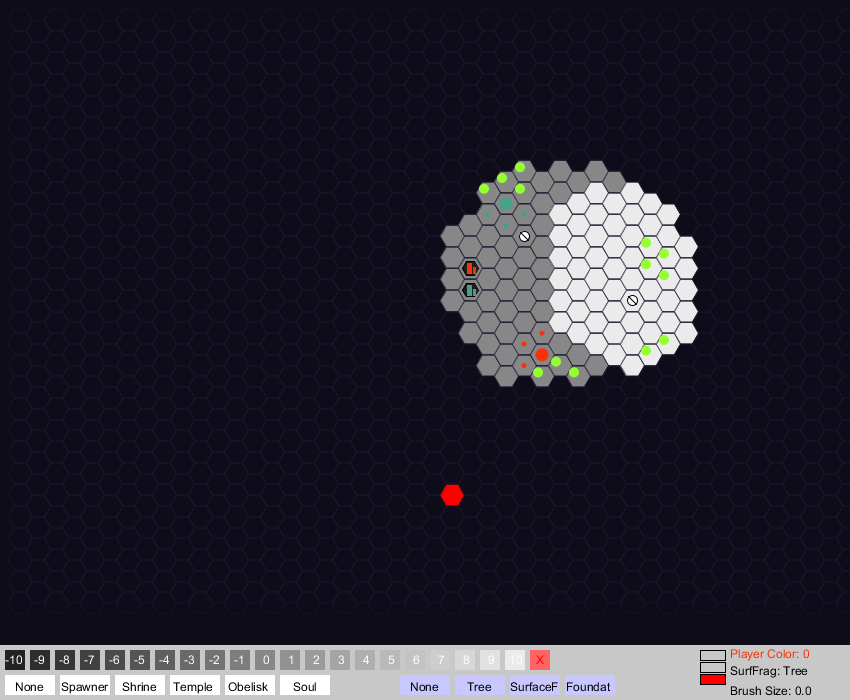

# ascension-map-maker

A utilitarian-looking map maker built in Processing for my 2012 college final project, [Ascension](https://github.com/gkjohnson/ascension-game).



## Controls

### Keys
```
LEFT / RIGHT :        Decrease / Increase brush size
UP / DOWN :           Change map layer

0-9 :                 Change player icons are being placed for

Shift-C :             Clear map

Enter :               Run command
```

### Commands
Commands can be typed with lowercase characters for loading or saving maps. Hit "Enter" to execute a command.

#### save [map-name]
Saves `[map-name].bytes` into the `maps` directory.

#### load [map-name]
Loads `maps/[map-name].bytes` into the editor.
